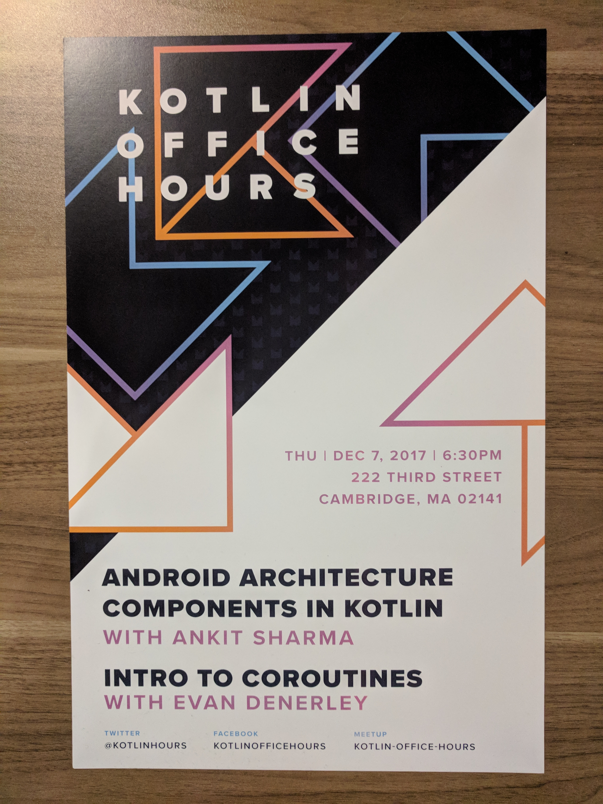

# PopularMoviesKotlin
To run the app, in your gradle.properties file, add

```
MYTMDBOPENAPIKEY="YOUR_TMDB_API_KEY_HERE"
```
A basic App which demonstrates how to use Kotlin with Android Arch Components with Retrofit 2, Rx 2, Dagger 2. The original code was used to present at Kotlin Office hours at Intrepid. (Poster below)

Update Oct 9 2020: Added a `hilt` branch which demonstrates hilt with MVVM.


